[TOC]

> 主要参考[^6]

行为识别主要包含两个方向，

1. 动作分类，给出一个视频截断，判断视频的动作类别，或者称为offline。
2. 动作识别，给出一个自然视频，没有进行任何的裁剪，这个时候需要先知道动作的开始时间和结束时间，然后还要知道动作的类别

# iDT算法**(2013)**

> Dense Trajectories and Motion Boundary Descriptors for Action Recognition
>
> Action Recognition with Improved Trajectories

密集轨迹算法(Dense Trajectories算法):Improve dense trajectory简称iDT，是一种用来提取视频密集跟踪轨迹的算法；通常基于该轨迹进行取块计算descriptor

算法基本框架


如图所示即为算法的基本框架，包括:

1. **密集采样特征点**，
2. **特征点轨迹跟踪**
3. **基于轨迹的特征提取**

## 密集采样

1. DT方法通过网格划分的方式在图片的**多个尺度上分别密集采样特征点**。

   在多个空间尺度上采样能保证采样的特征点覆盖了所有空间位置和尺度，通常8个空间尺度已经非常足够了，若图像很大，可以适当增加。后续的特征提取也是在各个尺度上分别进行的。

2. 特征点采样的间隔(即网格的大小)W通常取W=5。

> 多尺度的解释
>
> |                                                              |                                                              |                                                     |
> | ------------------------------------------------------------ | ------------------------------------------------------------ | --------------------------------------------------- |
> |  | 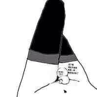 |  |

对图片进行缩放以便对各种尺度的对象都能进行识别。

## 特征点轨迹跟踪

在视频序列中对每一帧的兴趣点进行跟踪就形成trajectory，若是对每一帧密集采样兴趣点进行跟踪就形成dense trajectory；

1. 对采样点进行跟踪：由光流判断跟踪点在下一帧的位置；

   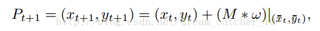M为中值滤波器，w为光流场

2. 对每个点跟踪都会形成一条trajectory，**为了避免长时间跟踪而产生的跟踪点漂移现象**，可以对跟踪的长度L进行约束（L=15）

   > ==这里也就暴漏了该方法不能处理长视频的原因==

3. 现实视频中存在摄像头运动的缺陷，因此需要相应算法消除摄像头影响，得到最终的iDT；

## **基于iDT计算descriptor**

四种特征：

1. trajectory轨迹特征：

   每条trajectory都可以提取一个轨迹特征向量S'（当L=15，S’为30维），对局部动作模式进行编码

   

2. HOG特征：

   HOG特征计算的是**灰度图像梯度的直方图**。对视频块进行表面特征描述。直方图的bin数目为8。所以HOG特征的长度为2X2X3X8=96.

3. HOF特征：

   HOF计算的是**光流的直方图**。直方图的bin数目取为8+1，前8个bin与HOG都相同。额外的一个用于统计光流幅度小于某个阈值的像素。故HOF的特征长度为2*2*3*9=108.

4. MBH特征：

   MBH计算的是**光流图像梯度的直方图**，也可以理解为在光流图像上计算的HOG特征。由于光流图像包括X方向和Y方向，故分别计算MBHx和MBHy。MBH总的特征长度为2*96=192. 最后进行特征的归一化，DT算法中对HOG，HOF和MBH均使用L2范数进行归一化。

## 特征编码和分类过程

1. 特征编码—Bag of Features
2. 分类-SVM

# Two-Stream(NIPS2014)

> Two-stream convolutional networks for action recognition in videos[^4]

Two-Stream CNN网络顾名思义分为两个部分，

1. **空间流**处理**RGB图像**，得到形状信息;
2. **时间流/光流**处理**光流图像**，得到运动信息。

两个流最后经过softmax后，做分类分数的融合，可以采用平均法或者是SVM。不过这两个流都是二维卷积操作。最终联合训练，并分类。


如图所示，其实做法非常的简单，相当于训练两个CNN的分类器。一个是专门对于 RGB 图的， 一个专门对于光流图的， 然后将两者的结果进行一个 fushion 的过程。

- RGB图的选择：

  是对于所给的一段视频随机挑选出视频中的**任意一帧**；

- 光流图的选择：

  视频中的任意一帧的时间然后及其后面的N帧叠合成一个光流栈进入训练。这种光流的训练方式是论文作者认为，这样子的光流叠加可以获得它的**运动信息流**，但是实际上光流图并不是以motion的信息来得到结果，有兴趣可以参看下面参考资料[^1]

  > 因为这个双流法是训练了两个网络，在最后 softmax 前进行了fushion，显示效果不错。这是一篇14年的开篇之作，在16年[^2]时候，有人对fushion的位置**==(可以类比通道混洗进行一番研究)==**进行了研究。

## 对于长范围时间结构的建模无能为力

主要因为它仅仅操作一帧（空间网络）或者操作短片段中的单堆帧（时间网络），因此**对时间上下文的访问是有限**的。视频级框架**TSN可以从整段视频中建模动作**。

# TSN(ECCV2016)

> Temporal Segment Networks Towards Good Practices for Deep Action Recognition[^13]

根据 two-stream 改进的网络框架。这一个框架的改进初衷是因为最原始版本的**two-stream对长视频的内容分类效果并不好**。

## 长视频处理的优点：

比如各个学校都是有运动会的，现在我们来到跳远场地拍了一段一位选手的**跳远过程视频**。然后我们将这段视频丢给原先的 Two-stream 框架进行测试，结果**得到了一个跑步的结果**。这是为什么呢？

就是因为我们**抽取机制的方式**，我们**随机抽取与训练的方式**，不能覆盖的这段视频的过程。因为跳远是一个助跑与跳的过程，他有比较强烈的时间序列性质。

## 与two-stream的对比：

1. 相同：

   TSN也是由空间流卷积网络和时间流卷积网络构成。

2. 不同：

   不同于two-stream采用**单帧或者单堆帧**。

   1. 采样：TSN使用从**整个视频中稀疏地采样一系列短片段**，
   2. 初步预测：**每个片段都将给出其本身对于行为类别的初步预测**，
   3. 提取共识：从这些片段的“共识”来得到视频级的预测结果。
   4. 在学习过程中，通过迭代更新模型参数来优化视频级预测的损失值（loss value）。

## TSN的改进

而TSN改进的方面非常的简单，它只是：

1. 先将视频**分成K个部分**，
2. 然后从每个部分中随机的**选出一个短的片段**，
3. 然后对这个片段应用上述的two-stream方法，
4. 最后**对于多个片段上提取到的特征做一个融合**。
   

## 细节：

由上图所示，一个输入视频被分为 K 段（segment），一个片段（snippet）从它对应的段中随机采样得到。不同片段的类别得分采用**段共识函数**（The segmental consensus function）进行**融合来产生段共识**（segmental consensus），这是一个视频级的预测。然后对所有模式的预测融合产生最终的预测结果。

具体来说，给定一段视频 *V*，把它按相等间隔分为 *K*K 段 ${S_1,S_2,⋯,S_K}$。接着，TSN按如下方式对一系列片段进行建模：


其中：

- (T1,T2,⋯,TK)代表片段序列，每个片段 Tk从它对应的段 Sk中随机采样得到。
- F(Tk;W)函数代表采用 W作为参数的卷积网络作用于短片段 Tk，函数返回 Tk 相对于所有类别的得分。
- 段共识函数 G（The segmental consensus function）结合多个短片段的类别得分输出以获得他们之间关于**类别假设的共识。**
- 基于这个共识，预测函数 H 预测整段视频属于每个行为类别的概率（本文 H  选择了Softmax函数）。
- 结合标准分类交叉熵损失（cross-entropy loss），关于部分共识的最终损失函数 G 的形式为：


其中，C 是行为总类别数，yi 是类别 i 的groundtruth，实验中片段的数量 K 设置为3。本工作中共识函数 G 采用最简单的形式，即 Gi=g(Fi(T1),…,Fi(TK))，采用用聚合函数 g（aggregation function）从所有片段中相同类别的得分中推断出某个类别分数 Gi。聚合函数 g 采用均匀平均法来表示最终识别精度。

TSN是可微的，或者至少有次梯度，由 g 函数的选择决定。这使我们可以用标准反向传播算法，利用多个片段来联合优化模型参数 W。在反向传播过程中，模型参数 W 关于损失值 L 的梯度为：


其中，K是TSN使用的段数。TSN从整个视频中学习模型参数而不是一个短的片段。与此同时，通过对所有视频固定 K，作者提出了一种稀疏时间采样策略，其中采样片段只包含一小部分帧。与先前使用密集采样帧的方法相比，这种方法大大降低计算开销.

# C3D(ICCV2015)

Learning spatiotemporal features with 3d convolutional networks[^3]

[github:Caffe](https://github.com/facebook/C3D)

> C3D是除了Two-Stream后的另外一大主流方法，但是目前来看C3D的方法得到的效果普遍比Two-Stream方法低好几个百分点。但是C3D仍然是目前研究的热点，主要原因是该方法比Two-Stream方法快很多，而且基本上都是端到端的训练，网络结构更加简洁。该方法思想非常简单，图像是二维，所以使用二维的卷积核。**视频是三维信息，那么可以使用三维的卷积核。**所以C3D的意思是：**用三维的卷积核处理视频。**

## **3D-CNN和2D-CNN的区别**

此部分采用C3D网络架构提取视频序列帧的特征，类似于2D卷积，3D卷积的形象描述如下图3(c)所示。3D卷积对H、W和L三个维度都进行卷积，而2D卷积（多通道(b)）只对H和W两个维度进行卷积，因此3D卷积得到的是三维输出，而2D卷积得到的是二维输出。

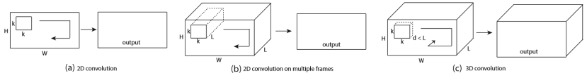

区别：

- a)和b)分别为2D卷积用于单通道图像和多通道图像的情况（此处多通道图像可以指同一张图片的3个颜色通道，也指多张堆叠在一起的图片，即一小段视频），对于一个滤波器，输出为一张二维的特征图，多通道的信息被完全压缩了。
- 而c)中的3D卷积的输出仍然为3D的特征图。

如果输入一段视频，其大小是,其中C是通道数(一般是3),，h和w分别是每帧的高和宽，3D卷积的卷积核和池化核也是3D的，很容易想象得到，就是比2D的往里扩展一个维度，所以核大小是d是核的时间深度，K*K是空间上的大小。

## 网络结构

网络结构也特别的简单：

C3D共有8次卷积操作，5次池化操作。其中卷积核的大小均为$3*3*3$，步长为$1*1*1$。池化核为$2*2*2$，但是为了不过早的缩减在时序上的长度，第一层的池化大小和步长为$1*2*2$。

最后网络在经过两次全连接层和softmax层后得到的最终的输出结果。网络的输入为$3*16*112*112$，其中3为RGB三通道，16为输入图像的帧数，$112*112$是图像的输入尺寸。

```python
class C3D(nn.Module):
    """
    The C3D network as described in [1].
    """

    def __init__(self):
        super(C3D, self).__init__()

        self.conv1 = nn.Conv3d(3, 64, kernel_size=(3, 3, 3), padding=(1, 1, 1))
        self.pool1 = nn.MaxPool3d(kernel_size=(1, 2, 2), stride=(1, 2, 2))

        self.conv2 = nn.Conv3d(64, 128, kernel_size=(3, 3, 3), padding=(1, 1, 1))
        self.pool2 = nn.MaxPool3d(kernel_size=(2, 2, 2), stride=(2, 2, 2))

        self.conv3a = nn.Conv3d(128, 256, kernel_size=(3, 3, 3), padding=(1, 1, 1))
        self.conv3b = nn.Conv3d(256, 256, kernel_size=(3, 3, 3), padding=(1, 1, 1))
        self.pool3 = nn.MaxPool3d(kernel_size=(2, 2, 2), stride=(2, 2, 2))

        self.conv4a = nn.Conv3d(256, 512, kernel_size=(3, 3, 3), padding=(1, 1, 1))
        self.conv4b = nn.Conv3d(512, 512, kernel_size=(3, 3, 3), padding=(1, 1, 1))
        self.pool4 = nn.MaxPool3d(kernel_size=(2, 2, 2), stride=(2, 2, 2))

        self.conv5a = nn.Conv3d(512, 512, kernel_size=(3, 3, 3), padding=(1, 1, 1))
        self.conv5b = nn.Conv3d(512, 512, kernel_size=(3, 3, 3), padding=(1, 1, 1))
        self.pool5 = nn.MaxPool3d(kernel_size=(2, 2, 2), stride=(2, 2, 2), padding=(0, 1, 1))

        self.fc6 = nn.Linear(8192, 4096)
        self.fc7 = nn.Linear(4096, 4096)
        self.fc8 = nn.Linear(4096, 487)

        self.dropout = nn.Dropout(p=0.5)

        self.relu = nn.ReLU()
        self.softmax = nn.Softmax()

    def forward(self, x):
        # a pytorch batch(n, ch, fr, h, w)
        h = self.relu(self.conv1(x))
        h = self.pool1(h)

        h = self.relu(self.conv2(h))
        h = self.pool2(h)

        h = self.relu(self.conv3a(h))
        h = self.relu(self.conv3b(h))
        h = self.pool3(h)

        h = self.relu(self.conv4a(h))
        h = self.relu(self.conv4b(h))
        h = self.pool4(h)

        h = self.relu(self.conv5a(h))
        h = self.relu(self.conv5b(h))
        h = self.pool5(h)

        h = h.view(-1, 8192)
        h = self.relu(self.fc6(h))
        h = self.dropout(h)
        h = self.relu(self.fc7(h))
        h = self.dropout(h)

        logits = self.fc8(h)
        probs = self.softmax(logits)

        return probs
```

# RPAN(ICCV2017)

> RPAN：An End-to-End Recurrent Pose-Attention Network for Action Recognition in Videos[^7]

参考[^5]

## 创新点：

- 不同于之前的pose-related action recognition，这篇文章是端到端的RNN，而且是spatial-temporal evolutionos of human pose
- 不同于独立的学习关节点特征(human-joint features)，这篇文章引入的pose-attention机制通过不同语义相关的关节点(semantically-related human joints)分享attention参数，然后将这些通过human-part pooling层联合起来
- 视频姿态估计，通过文章的方法可以给视频进行粗糙的姿态标记

## 网络结构

整个网络框架可以分成三个大的部分：

- 特征生成部分：Conv Feature cube from CNN
- 姿态注意机制：Pose-Attention Mechanism
- LSTM：RNN网

下面是整体网络结构图：

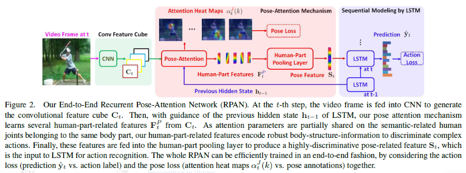

1. 特征生成部分Convolution Feature Cube from CNN

   作者采用了 two-stream CNN[^4]的网络框架，生成了convolution cubes。包含空间和时间上的。

2. Pose Attention Mechanism(姿态注意机制)

   1. Step1： 

      经过上述two-stream cnn后生成了 K1 x K2 x dc的特征图，文章中叫convolutional cube。然后作者定义了一个Ct，表示第t个视频帧在不同空间位置上的特征向量。空间图是K1xK2的大小，共dc个通道。所以Ct是K1xk2个dc维的向量。Ct的定义如下:

   2. Step2：

      作者定义了一些关节点，总共有13个。然后由这13个关节点，作者定义了5个身体的part。定义如下图所示。

      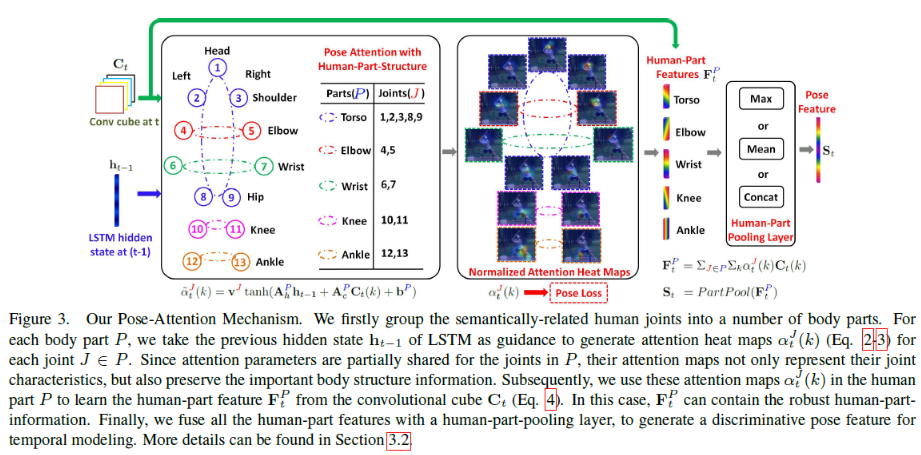

   3. Step3：

      经过pooling层，将所有part特征整合到一起。使用的方法就是简单的Max,Mean or Concat。

      

   

3. LSTM

   最后将St输入到LSTM网络中：

   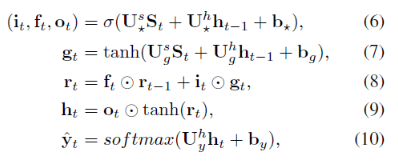

# CDC(CVPR2017)

> Convolutional-De-Convolutional Networks for Precise Temporal Action Localization in Untrimmed Videos[^9]

在C3D网络的后面增加了时间维度的上采样操作，做到了帧预测(frame level labeling)。以下是文章主要贡献点。

- 第一次将卷积、反卷积操作应用到行为检测领域，CDC同时在**空间域上下采样**，在**时间域上上采样**。
- 利用CDC网络结构可以做到**端到端的学习**[^8]。
- 通过反卷积操作可以做到**帧预测**(Per-frame action labeling)。

## 网络结构

CDC网络在C3D的基础上用反卷积，将时序升维。做到了帧预测。以下是CDC网络的结构图。

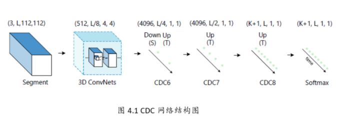

网络步骤如下所示。

- 输入的视频段是112x112xL，连续L帧112x112的图像
- 经过C3D网络后，时间域上L下采样到 L/8, 空间上图像的大小由 112x112下采样到了4x4
- CDC6: 时间域上上采样到 L/4, 空间上继续下采样到 1x1
- CDC7: 时间域上上采样到 L/2
- CDC8：时间域上上采样到 L，而且全连接层用的是 4096xK+1, K是类别数
- softmax层

CDC网络的最终输出形状是(K+1，L，1，1)，其中K+1表示K个动作类别加上背景类。

## CDC FILTER

文章的还有一大贡献点是反卷积的设计，因为经过C3D网络输出后，存在时间和空间两个维度，文章中的CDC6完成了时序上采样，空间下采样的同时操作。


如上图所示，（a）(b)一般的都是先进行空间的下采样，然后进行时序上采样。

(c)但是CDC中设计了两个独立的卷积核(下图中的红色和绿色)。同时作用于112x112xL/8的特征图上。每个卷积核作用都会生成2个1x1的点，如上conv6，那么两个卷积核就生成了4个。相当于在时间域上进行了上采样过程。

# R-C3D(ICCV2017)

> R-c3d: Region convolutional 3d network for temporal activity detection[^10]

## 网络结构

输入是整个视频（或者任意长度视频段），C3D特征的输出被第2步和第3步共享。

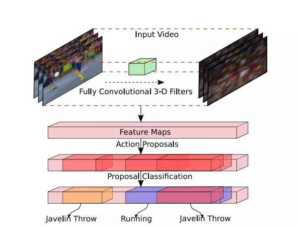


网络的总体结构:

1. 特征提取网络:

   C3D网络构成的特征提取网络提取特征，等效于Faster-RCNN中的ImageNet预训练的特征网络。骨干网络作者选择了C3D网络，经过C3D网络的5层卷积后，可以得到512 x L/8 x H/16 x W/16大小的特征图。这里不同于C3D网络的是，R-C3D**允许任意长度的视频L作为输入**。

2. **Temporal Proposal Subnet**给出建议区域:
  

   根据C3D特征，给可能包含活动（activities）的时间区域（propose temporal regions）。等效于Faster-RCNN中的RPN,这里被称为Proposal Subnet

   1. 候选时序生成

      输入视频经过上述C3D网络后得到了512 x L/8 x H/16 x W/16大小的特征图。然后作者假设anchor均匀分布在L/8的时间域上，也就是有L/8个anchors，每个anchors生成K个不同scale的候选时序。

   2. 3D Pooling

      得到的 512xL/8xH/16xW/16的特征图后，为了获得每个时序点（anchor）上每段候选时序的中心位置偏移和时序的长度，作者将空间上H/16 x W/16的特征图经过一个3x3x3的卷积核和一个3D pooling层下采样到 1x1。最后输出 512xL/8x1x1.

   3. Training

      类似于Faster R-CNN，这里也需要判定得到的候选时序是正样本还是负样本。文章中的判定如下。

      - 正样本：IoU > 0.7，候选时序帧和ground truth的重叠数
      - 负样本： IOU < 0.3
   为了平衡正负样本，正/负样本比例为1:1.
  
3. Activity Classification Subnet行为分类子网络:

   根据C3D特征和建议区域，得到区域内的实际活动（activities）类型，比如图中的跑步。等效于Faster-RCNN中的ROI POOLING+网络后半段的分类网络，这里被称为Classification Subnet。

   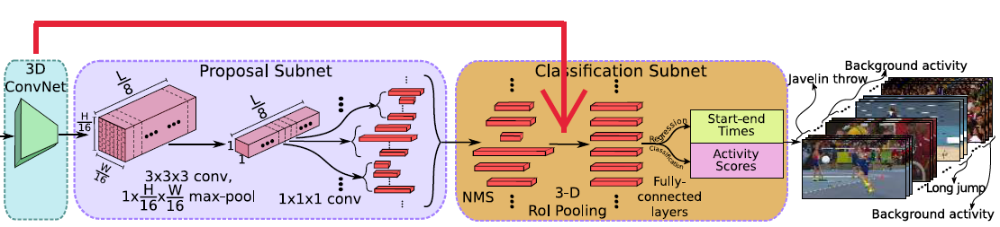

   1. NMS

      针对上述Temporal Proposal Subnet提取出的segment，采用NMS(Non-maximum Suppression)非极大值抑制生成优质的proposal。NMS 阈值为0.7.

   2. 3D RoI

      RoI (Region of interest,兴趣区域).这里，个人感觉作者的图有点问题，提取兴趣区域的特征图的输入应该是C3D的输出，也就是512xL/8xH/16xW/16，可能作者遗忘了一个输入的箭头。 假设C3D输出的是 512xL/8x7x7大小的特征图，假设其中有一个proposal的长度（时序长度）为lp，那么这个proposal的大小为512xlpx7x7，这里借鉴SPPnet中的池化层，利用一个动态大小的池化核，ls x hs x ws。最终得到 512x1x4x4大小的特征图

   3. 全连接层

      经过池化后，再输出到全连接层。最后接一个边框回归(start-end time )和类别分类(Activity Scores)。

   4. Traning

      在训练的时候同样需要定义行为的类别，如何给一个proposal定label？同样采用IoU。

      - IoU > 0.5，那么定义这个proposal与ground truth相同
      - IoU 与所有的ground truth都小于0.5，那么定义为background

      这里，训练的时候正/负样本比例为1:3。

# I3D(CVPR2017)

>Paper:[Quo Vadis, Action Recognition? A New Model and the Kinetics Dataset](https://arxiv.org/pdf/1705.07750.pdf)
>
>github: [kenetics-i3d](https://github.com/deepmind/kinetics-i3d)

主要参考：https://blog.csdn.net/Gavinmiaoc/article/details/81208997

## 三类模型的对比

Figure 2. Video architectures considered in this paper. K stands for the total number of frames in a video, whereas N stands for a subset of neighboring frames of the video.

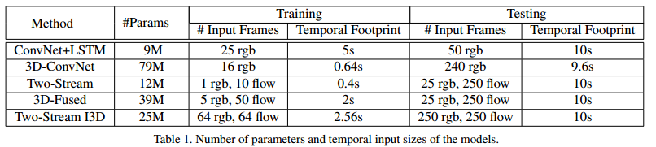


### ConvNet + LSTM

> Long-term recurrent convolutional networks for visual recognition and description(2015)[^11]

- 由于图像分类网络效果特别好，因此人们总想**尽可能原封不动地把模型应用到视频上**，如Karpathy做的那篇early/late/slow fusion的文章，**但这样就会导致模型忽视了时序结构**（如不能分辨开门与关门）
- 因此，可以在模型后面加上**LSTM来处理时序问题**
- 模型细节：把LSTM和BN加在Inception v1的最后一个average pooling层后面（即分类器之前），有512个节点。在模型最顶部加一个全连接层用于分类；The model is trained using cross-entropy losses on the outputs at all time steps. During testing we consider only the output on the last frame；输入帧是在25帧/s的视频流中每5帧取1帧，根据表1给出的信息，作者应该是从数据集的video中选取了5s的视频片段，所以总共是5s * 25帧/s * 1/5 = 25张rgb图像

### 3D ConvNet

> Learning spatiotemporal features with 3d convolutional networks(2015)[^3]

- 3D ConvNet看上去是一种很自然的方法，能够直接对于时空数据创建高层表征
- 但这个模型有两个问题：
  1. 相比于2D，**参数更多，也就更难训练**（因为数据量不足），所以之前3D ConvNet用的都是浅层的架构
  2. 由于都是三维的核，无法直接用在ImageNet上预训练过的网络，因此只能在video数据集上train from scratch。由于之前的数据集量都太小，因此**效果不是太有竞争力**。但这种方法可能会比较适用于大数据集
- 模型细节：

  是原论文中C3D的变种。8层卷积、5层pooling、2层全连接。与C3D的区别在于这里的卷积和全连接层**后面加BN**；且在第一个pooling层使用stride=2，这样使得batch_size可以更大。输入是16帧，每帧112*112。

### Two-Stream Networks

>Two-stream convolutional networks for action recognition in videos(NIPS2016)[^4]

- LSTM缺点：

  能model高层变化却**不能捕捉低层运动**(因为**在低层，每个帧都是独立地被CNN提取特征**)，有些低层运动可能是重要的；训练很昂贵

- Two-Stream Networks: 

  将单独的一张RGB图片和一叠计算得到的光流帧分别送入在ImageNet上预训练的ConvNet中，再把两个通道的score取平均。这种方法在现在的数据集上效果很好，训练和测试都十分经济。

- 一个改进(Fused Two-Stream): 

  在最后一层卷积层之后，**使用3D ConvNet把空间流和时间流融合**（相比于传统双流是在softmax后才做fusion，把softmax输出的score进行平均）

  > 在HMDB数据集上提升了效果，测试时间也更短

- 模型细节：

  输入是每隔10帧取连续的5帧以及相应的光流。在Inception v1之后，是一个$3*3*3$的3D卷积层，输出是512个channel，随后是一个$3*3*3$的3D max-pooling层以及全连接层。这个新的网络是用高斯随机初始化

- **对于双流网络有两种实现**：
  
  >Convolutional two-stream network fusion for video action recognition(CVPR2016)[^12]
  
  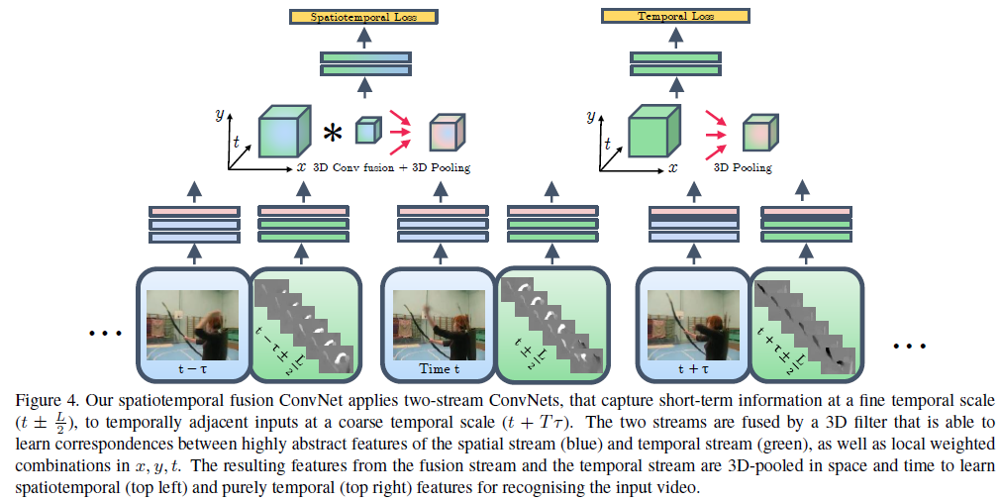
  
  1. 一种实现是训练时把**两个流分开训练**，测试的时候在最后把两个流的**预测结果做平均**；
  2. 第二种是直接端到端进行训练。在c)和d)的实现中使用的是端到端；而在e)的实现中使用了第一种实现
  3. (d)**新双流**：作者**实现使用InceptionV1**，后面的融合部分改为**3D卷积，3D pooling**，最终通过一个全连接层进行分类。网络的输入是相隔10帧采样的5个连续RGB帧，采用端到端的训练方式，如图1(d)。
  4. (e)**双流 inflated 3D卷积**：扩展2D卷积basemodel为3D basemodel卷积，卷积核和pooling**增加时间维**，尽管3D卷积可以直接学习时间特征，但是将光流加进来后会提高性能。

## New*: Two-Stream Inflated 3D ConvNets

### **Inflating 2D ConvNets into 3D**

- 为了避免时空模式的重复过程，可以把一些很成功的2D模型转移成3D，通过把所有卷积核以及pooling核增加时间的一维来进行实现

### **Bootstrapping 3D filters from 2D filters**

- 利用在ImageNet上预训练好的2D模型的参数；

- **Idea**: 若是把ImageNet中的同一张图片反复复制生成一个序列，那么这个序列就可以当作是一个video来训练3D模型了

  > 具体实现：**把2D模型中的核参数在时间维上不断复制，形成3D核的参数，同时除以N，保证输出和2D上一样；别的非线性层结构都与原来的2D模型一样**

### Pacing receptive field growth in space, time and network depth

> 对于3D来说，**时间维度不能缩减地过快或过慢**。如果时间维度的感受野尺寸比空间维度的大，将会合并不同物体的边缘信息。反之，将捕捉不到动态场景。因此改进了BN-Inception的网络结构。

- 在Image模型中，对待**水平和垂直两个空间维度往往是一致的**，也就是两个维度上pooling核大小以及stride都一样
- 在**时间维度上这样的对称对待未必是最优的**(也就是时间维度上的pooling核大小选与空间上的一致是不可取的)，因为这取决于帧率和图像大小之间的相对值
- **具体实现：**在Inception v1中，
  - 涉及到感受野变化的就是**第一个卷积核(stride=2)以及后续4个max-pooling(stride=2)**，还有**最后的一个$7*7$的average-pooling层**。
  - 在本文的实验中，作者发现：在前两个max-pooling层上，时间维度上的stride取1；而在别的max-pooling层上使用对称的stride(即时间维度上的stride和空间上的一致)；最后的average pooling使用$2*7*7$的核。

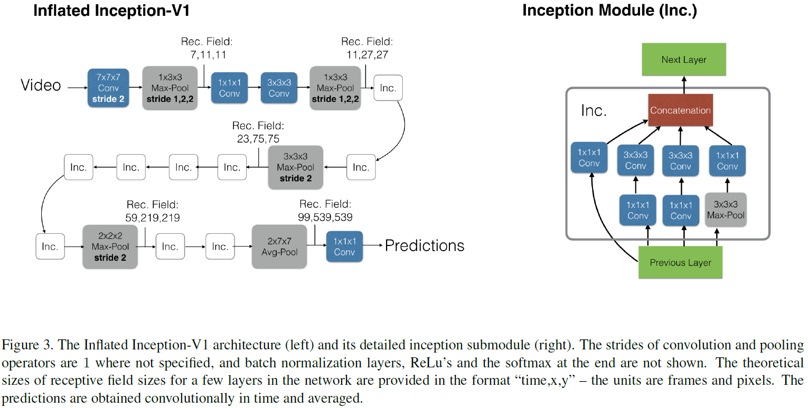

### **I3D双流网络：**

RGB和光流是分开训练的，测试时将它们预测的结果进行平均,如下图。

| 模型结构                                                     | 实现细节                                                     |
| ------------------------------------------------------------ | ------------------------------------------------------------ |
|  | 除了C3D其他模型使用预训练的Inception-V1作为基网络，除了最后的卷积层之外，对其他卷积层进行了BN操作和ReLU激活。<br/>在所有情况下，视频训练使用标准SGD，动量设置为0.9， 作者在Kinetics数据集上训练了110k步的模型，当验证损失饱和时，学习率降低了10倍。在Kinetics的验证集上调整了学习率超参数。模型在UCF-101和HMDB-51上训练模型达5k步，使用相似学习率适应程序。在训练期间，spatial上是先将原始帧resize成$256*25$6的，然后随机剪裁成$224*224$的。在temporal上，尽量选择前面的帧以保证足够光流帧的数目足够多。短的视频循环输入以保证符合网络的input_size。在训练中还用到了随机的左右翻转。测试的时候选用中心剪裁$224*224$，将整条视频的所有帧输入进去，之后average_score。实验测试256x256的视频并没有提高，测试时左右翻转video，训练时增加额外的augmentation，如phonemetric，可能有更好的效果。<br/> |

- 训练时，分别训练这两个网络，测试的时候在最后把两个流的预测结果做平均


## 实验性能比较

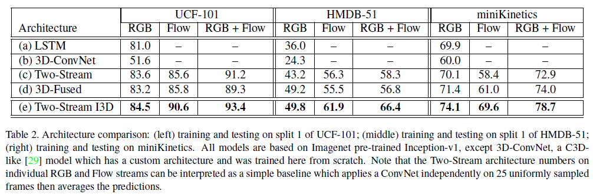

# S3D(arXiv2018)

> Rethinking Spatiotemporal Feature Learning: Speed-Accuracy Trade-offs in Video Classification

主要参考[^14]

## 文章想回答的3个问题

1. 我们**是否真的需要3d conv**? 如果需要的话，哪些层我们应该让他是3d的，哪些层可以是2d的？这个设置依赖于特定的数据集和任务吗？
2. 在时间和空间维度上**联合做卷积**是否很重要？还是说**单独在时间和空间维度上分别做卷积**也是足够用的？
3. 我们如何用上述问题的答案来提升算法的精度，速度和内存占用呢？

## Network surgery

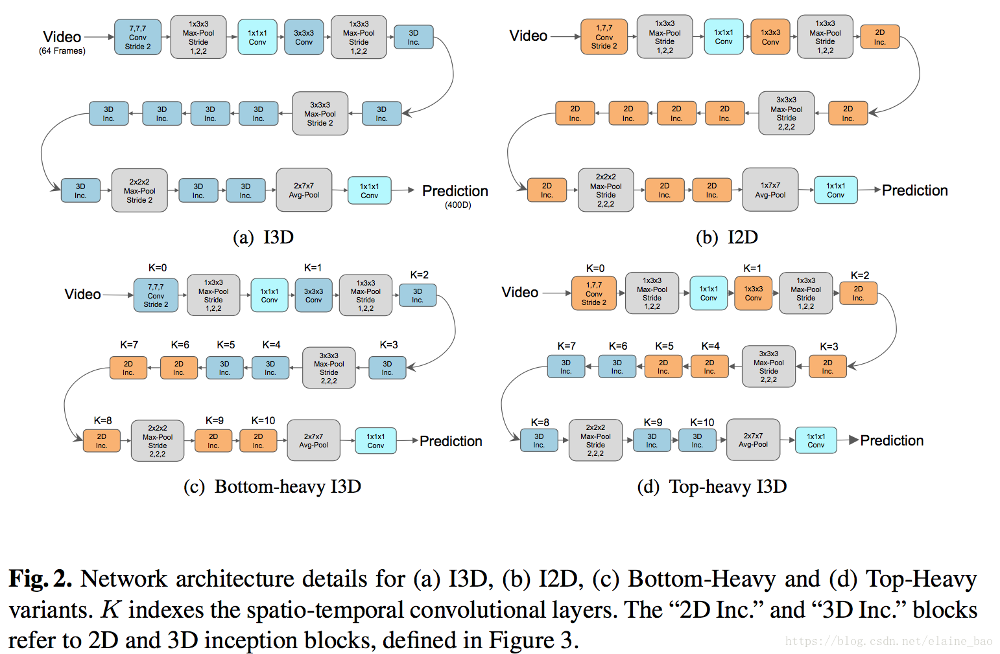

本文在I3D的基础上进行network surgery:

1. Bottom-Heavy-I3D：在网络的低层级使用3D时域卷积，在高层级使用2D卷积
2. Top-Heavy-I3D：在网络的低层级使用2D卷积，在高层级使用3D时域卷积。

我们发现**Top-Heavy-I3D模型更快**，这个不难理解，因为它只在抽象层的feature map上进行3D，这些feature map往往比低层级的feature map尺寸上更小。另一个发现是T**op-Heavy-I3D模型通常还更加精确**，这还挺惊讶的，因为毕竟它忽略了低层级的motion cues.

## 将所有3D conv替换成2D conv

将I3D中所有的3D conv替换成2D conv，如图Fig.2(a)==>(b)所示。然后在kinetics Full和something-something上进行训练测试。训练时都是按照正常的帧顺序输入，测试时考虑正常序和倒序两种帧顺序。结果如Table 1所示。

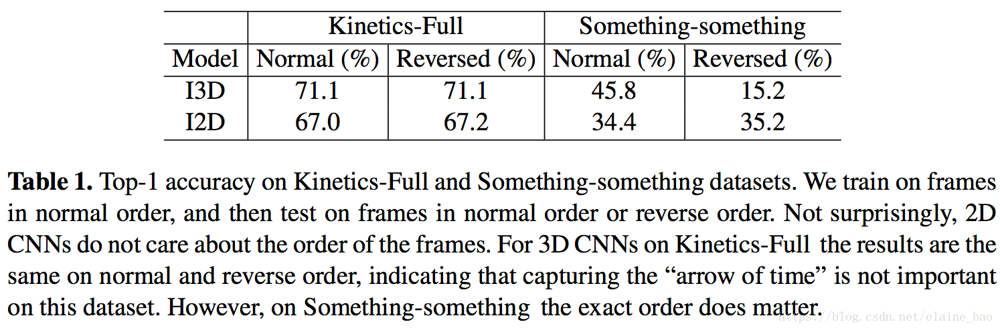

我们可以发现**I2D的表现在正常序和倒序是稳定的**，这符合续期。而I3D在Kinetics-Full数据集上正常序和倒序表现一致，而在Something-something数据集上倒序的精度低很多。我们认为这是因为Something-something这个数据集需要更细致的特征来区分视觉信息上非常相似的动作类别，例如“Pushing something from left to right” 和“Pushing something from right to left”。

## 将部分3D conv替换成2D conv

虽然我们从2.1的实验中看到

- 3D conv能够提高精度，但是它的计算量太大了。

所以在本节中，我们讨论将**部分3D conv替换成2D**。我们以I2D作为起点，

- 从低层级逐渐向高层级inflate 2D conv到3D,来得到**Bottom-Heavy-I3D**。
- 同样我们也从高层级逐渐向低层级inflate 2D conv到3D，来得到**Top-Heavy-I3D**。

我们在Mini-Kinetics-200和Something-something数据集上训练和测试，结果如Fig.4所示，

- 蓝色实线（top heavy I3D）比蓝色虚线（bottom heavy I3D）在相同的FLOPS下的acc高很多。top heavy I3D的速度优势是先天的（在小的feature map上进行计算），
- 同时Top-Heavy-I3D也比Bottom-Heavy-I3D在精度上更有优势，这可能说明3D conv对于在高层更具语义的层级里建模时间特征更加有效。

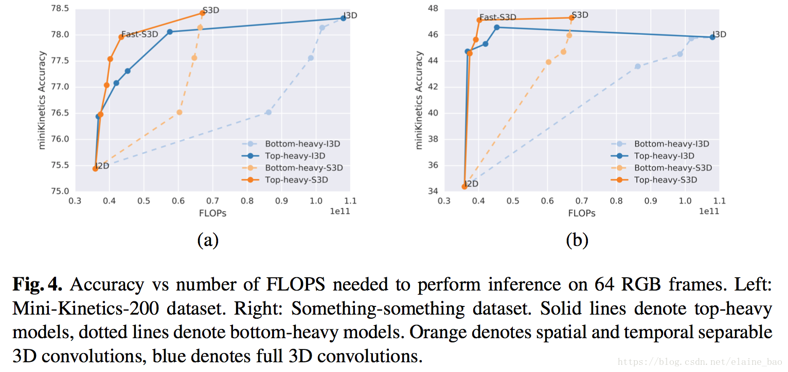

## 将temporal conv和spatial conv分离开

### 每个3D conv被分解成1个2D conv+1个1D conv，这样I3D就被改造成了S3D,如图Fig6所示。

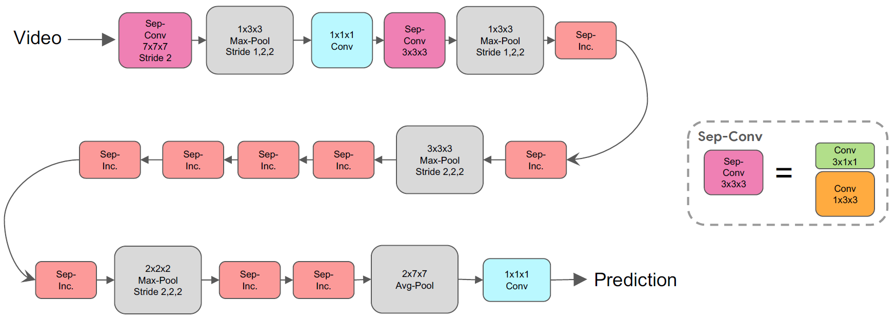

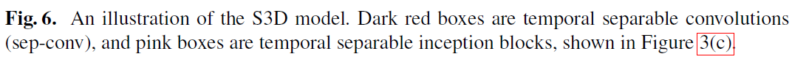

### 2D、3D and 3D temporal separable Inception block

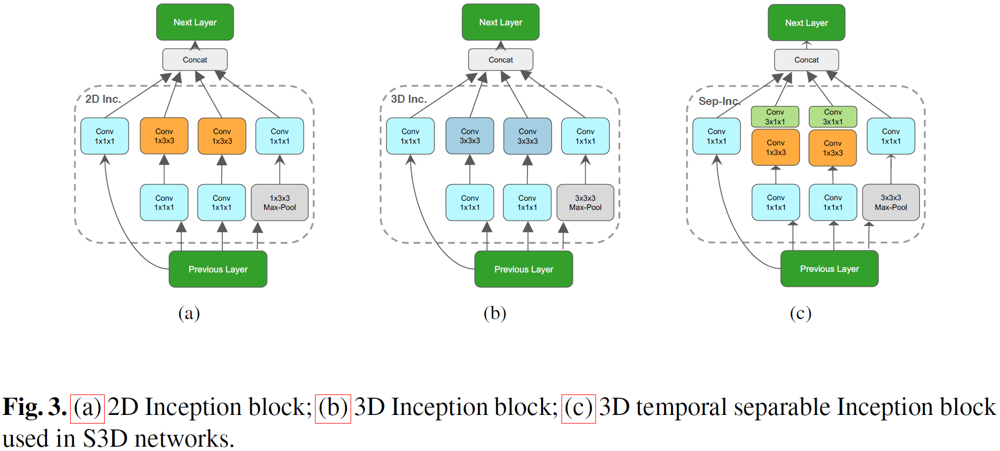

## 实验结果

Table 2，3对比了Kinetics-Full、Something-something上S3D和I3D的结果。S3D精度高，参数少，FLOPS小。我们认为这种acc上的增益是因为spatial-temporal的分解有利于减少overfitting，同时并没有降低模型的表达能力（我们发现单纯减少模型的参数对性能提升没有帮助）。

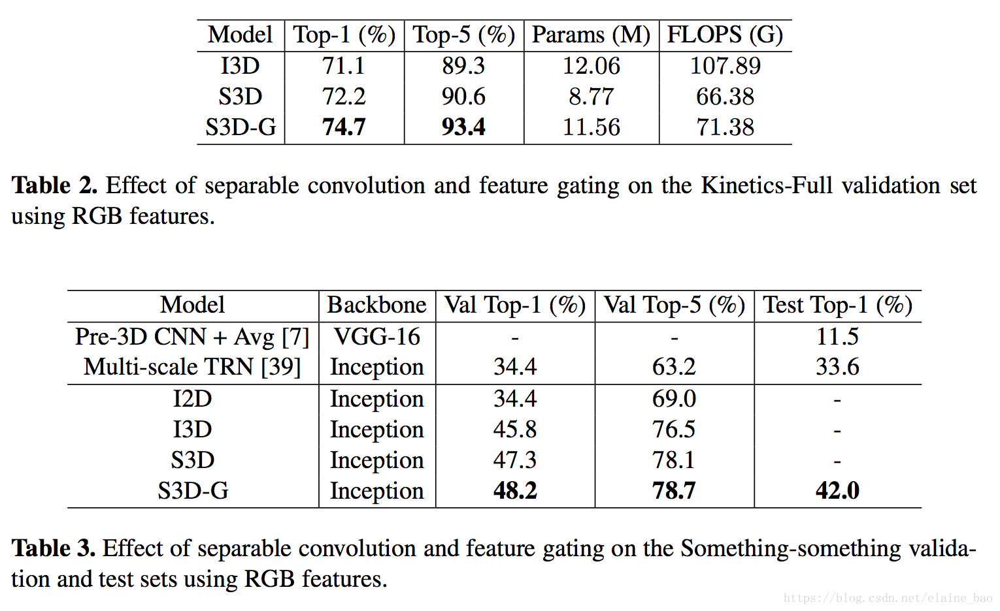

注意这种拆分的操作可以在任意3D conv上进行，因此Bottom-Heavy-I3D的拆分版本是Bottom-Heavy-S3D， Top-Heavy-I3D的拆分版本是 Top-Heavy-S3D。它们之间的性能对比如Fig4所示，我们发现seperate top-heavy模型能够在速度-精度之间做出很好的trade-off。另外，如果我们保留top 2 层为separable 3D conv，剩余的都是2D conv，我们发现速度-精度之间trade-off最好，称其为Fast-S3D。


[^1]:https://blog.csdn.net/elaine_bao/article/details/80891173【光流在视频识别中的作用】
[^2]:https://arxiv.org/abs/1604.06573
[^3]:Tran D, Bourdev L, Fergus R, et al. Learning spatiotemporal features with 3d convolutional networks[C]//Computer Vision (ICCV), 2015 IEEE International Conference on. IEEE, 2015: 4489-4497.http://vlg.cs.dartmouth.edu/c3d/c3d_video.pdf
[^4]:Simonyan K, Zisserman A. Two-stream convolutional networks for action recognition in videos[C]//Advances in neural information processing systems. 2014: 568-576.
[^5]:https://blog.csdn.net/neu_chenguangq/article/details/79164830?utm_source=blogxgwz7
[^6]:https://zhuanlan.zhihu.com/p/34439558

[^7]: Du W, Wang Y, Qiao Y. Rpan: An end-to-end recurrent pose-attention network for action recognition in videos[C]//Proceedings of the IEEE Conference on Computer Vision and Pattern Recognition. 2017: 3725-3734.
[^8]: https://blog.csdn.net/weixin_38145317/article/details/90902425【什么是端到端的训练或学习】
[^9]: Shou Z, Chan J, Zareian A, et al. CDC: convolutional-de-convolutional networks for precise temporal action localization in untrimmed videos[C]//2017 IEEE Conference on Computer Vision and Pattern Recognition (CVPR). IEEE, 2017: 1417-1426.
[^10]:Xu H, Das A, Saenko K. R-c3d: Region convolutional 3d network for temporal activity detection[C]//The IEEE International Conference on Computer Vision (ICCV). 2017, 6: 8.https://arxiv.org/pdf/1703.07814.pdf
[^11]: J. Donahue, L. Anne Hendricks, S. Guadarrama, M. Rohrbach, S. Venugopalan, K. Saenko, and T. Darrell. Long-term recurrent convolutional networks for visual recognition and description. In Proceedings of the IEEE Conference on Computer Vision and Pattern Recognition, pages 2625–2634, 2015.

[^12]: C. Feichtenhofer, A. Pinz, and A. Zisserman. Convolutional two-stream network fusion for video action recognition. In IEEE International Conference on Computer Vision and Pattern Recognition CVPR, 2016.
[^13]: https://arxiv.org/abs/1608.00859

[^14]:[时空域特征学习的反思：视频分类中速度与精度的权衡](https://blog.csdn.net/elaine_bao/article/details/83032085)