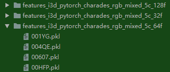
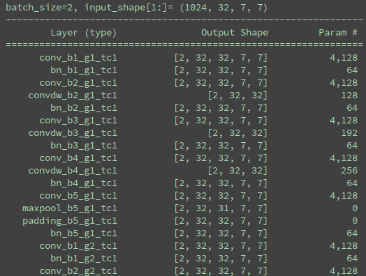

# Timeception for Complex Action Recognition

  

This code repository is the implementation for the paper [Timeception for Complex Action Recognition](https://arxiv.org/abs/1812.01289).
We provide the implementation for 3 different libraries: `keras`, `tensorflow` and `pytorch`.


# 预处理

1. 采样：

   对原始视频进行采样，采样的大小`T x Channels x H x W`：

   - $1024*3*224*224$
   - $512*3*224*224$
   - $256*3*224*224$

   

2. `I3D`进行特征提取：

   使用`I3D`对采样后的帧视频进行特征提取，特征提取后的大小为：`T x H x W x Channels`：

   - `128 x 7 x 7 x 1024​`
   - `64 x 7 x 7 x 1024​`
   - `32 x 7 x 7 x 1024​`

   

3. Timeception：

   以 `32 x 7 x 7 x 1024` 为例：

   -  `32 x 7 x 7 x 1024` + `8` `group` --> `32 x 7 x 7 x 128` ，将这个输入到每个`group` 中；
   - 接着在每个`branch`中的输入的尺寸是 `32 x 7 x 7 x 128`，然后经过一个卷集核为 `1x1x1`，步长为`1`的单位`conv3d`卷积将`Channels`降到`32`即 `32 x 7 x 7 x 32`；
   - 总共有`5`个分支，将5个 `branch` 得到的 `feature map` 进行组合的得到 `32 x 7 x 7 x 160`，再将 `8`个 `group` 组合得到 `32 x 7 x 7 x 1280`

# 对长期时间依赖性上的解决方案：

| timeception结构                                   | 解决方案                                                     |
| ------------------------------------------------- | ------------------------------------------------------------ |
|  | 1、**长期时间依赖性的处理：**采用多<br/>层堆叠的方式进行实现，以期学得<br/>更复杂抽象的时空特征。<br/><br>2、**时间成本的处理：**采用通道分组<br/>并同时引入通道混洗和连接操作 |

> - **N-Group操作之后：**
>
>   Concat ==> Relu ==> Shuffle ==>对时域的T进行下采样MaxPool
>
> - **采用通道分组的原因：**
>   优点：可以降低参数量，减少时间成本。
>   缺点：每个分组都值包含通道之间的部分相关性，不利于通道之间的信息交互。
>   处理办法：增加通道混洗和连接操作。通道混洗可以增加编码跨通道之间的相关性。因为每组通道都是所有通道的一个随机子集，都只包含部分的可能性。而这可以通过通道混洗和组合得到缓解
>
> - **在timeception-only前进行通道分组，后进行串联混洗：**
>
> 也处理了部分的空间信息，符合了第一个设计原则：子空间模块化（我认为既是：堆叠模块前后的一致性，为与ResNet/I3D串联堆叠提供理论基础。）

## 为了能够应对复杂动作多变的时间范围，采用多尺度替换固定尺度

### 多尺度实现的两种方式：

1. Inception卷积结构
2. dilated convolutions空洞卷积结构


## 具体的实习方法：


> **Note:**注意在实际编码过程中是先使用$1*1*1$的卷积核对通道数进行缩减，然后再使用深度可分离卷积进行卷积，与图中画的方向相反。

----

**仅以第一次循环为例,展示每一个branch的输入与输出的过程：**

- **Conv3d：**`kernel_size=(1, 1, 1)`，是为降低通道数量
- **DepthwiseConv1DLayer：**采用的是深度可分离的一维卷积，让输入和输出的`channels`相同，同时只对`n_timesteps`进行卷积，参数量为：`in_channels*kernel_size*out_channels`
- `input.shape=(batch*channels*T*H*W)`

### `branch 1`：只降低了维度没有时间卷积

```python
# branch 1: dimension reduction only and no temporal conv (kernel-size 1)
# 卷积操作
layer_name = 'conv_b1_g%d_tc%d' % (group_num, layer_num) #不同timeception层的不同group（组）在同一个branch（分支）上采用的是同一个操作
layer = Conv3d(n_channels_in, n_channels_per_branch_out, kernel_size=(1, 1, 1)) #n_channels_in = input.shape[1]/group_num, n_channels_per_branch_out为每个分支的输出的通道个数
layer._name = layer_name
setattr(self, layer_name, layer)
# BN操作
layer_name = 'bn_b1_g%d_tc%d' % (group_num, layer_num)
layer = BatchNorm3d(n_channels_per_branch_out)
layer._name = layer_name
setattr(self, layer_name, layer)
```

- 执行操作：

  ```python
  # branch 1: dimension reduction only and no temporal conv
  t_1 = getattr(self, 'conv_b1_g%d_tc%d' % (group_num, layer_num))(tensor) #第group_num组，第layer_num层，getattr()得到对象self的'conv_b1_g%d_tc%d'的属性，得到类似于Conv3d(250, 62, kernel_size=(1, 1, 1), stride=(1, 1, 1))的结果，由上面的setattr()函数设置
  t_1 = getattr(self, 'bn_b1_g%d_tc%d' % (group_num, layer_num))(t_1)
  ```

### `branch 2`:

```python
# branch 2: dimension reduction followed by depth-wise temp conv (kernel-size 3)
# 缩减通道
layer_name = 'conv_b2_g%d_tc%d' % (group_num, layer_num)
layer = Conv3d(n_channels_in, n_channels_per_branch_out, kernel_size=(1, 1, 1))# layer = Conv3d(n_channels_in = 128, n_channels_per_branch_out = 32, kernel_size=(1, 1, 1))
layer._name = layer_name
setattr(self, layer_name, layer)
#卷积
layer_name = 'convdw_b2_g%d_tc%d' % (group_num, layer_num)
layer = DepthwiseConv1DLayer(dw_input_shape, kernel_sizes[0], dilation_rates[0], layer_name)# layer = DepthwiseConv1DLayer(dw_input_shape=(32, 32, 128, 7, 7) , kernel_sizes[0], dilation_rates[0], layer_name)
setattr(self, layer_name, layer)
#BN操作
layer_name = 'bn_b2_g%d_tc%d' % (group_num, layer_num)
layer = BatchNorm3d(n_channels_per_branch_out)
layer._name = layer_name
setattr(self, layer_name, layer)
```

```python
# branch 2: dimension reduction followed by depth-wise temp conv (kernel-size 3)
t_2 = getattr(self, 'conv_b2_g%d_tc%d' % (group_num, layer_num))(tensor)
t_2 = getattr(self, 'convdw_b2_g%d_tc%d' % (group_num, layer_num))(t_2)
t_2 = getattr(self, 'bn_b2_g%d_tc%d' % (group_num, layer_num))(t_2)
```

### branch 3

```python
# branch 3: dimension reduction followed by depth-wise temp conv (kernel-size 5)
layer_name = 'conv_b3_g%d_tc%d' % (group_num, layer_num)
layer = Conv3d(n_channels_in, n_channels_per_branch_out, kernel_size=(1, 1, 1))
layer._name = layer_name
setattr(self, layer_name, layer)

layer_name = 'convdw_b3_g%d_tc%d' % (group_num, layer_num)
layer = DepthwiseConv1DLayer(dw_input_shape, kernel_sizes[1], dilation_rates[1], layer_name)
setattr(self, layer_name, layer)

layer_name = 'bn_b3_g%d_tc%d' % (group_num, layer_num)
layer = BatchNorm3d(n_channels_per_branch_out)
layer._name = layer_name
setattr(self, layer_name, layer)
```

```python
# branch 3: dimension reduction followed by depth-wise temp conv (kernel-size 5)
t_3 = getattr(self, 'conv_b3_g%d_tc%d' % (group_num, layer_num))(tensor)
t_3 = getattr(self, 'convdw_b3_g%d_tc%d' % (group_num, layer_num))(t_3)
t_3 = getattr(self, 'bn_b3_g%d_tc%d' % (group_num, layer_num))(t_3)
```

### branch 4

```python
# branch 4: dimension reduction followed by depth-wise temp conv (kernel-size 7)
layer_name = 'conv_b4_g%d_tc%d' % (group_num, layer_num)
layer = Conv3d(n_channels_in, n_channels_per_branch_out, kernel_size=(1, 1, 1))
layer._name = layer_name
setattr(self, layer_name, layer)

layer_name = 'convdw_b4_g%d_tc%d' % (group_num, layer_num)
layer = DepthwiseConv1DLayer(dw_input_shape, kernel_sizes[2], dilation_rates[2], layer_name)
setattr(self, layer_name, layer)

layer_name = 'bn_b4_g%d_tc%d' % (group_num, layer_num)
layer = BatchNorm3d(n_channels_per_branch_out)
layer._name = layer_name
setattr(self, layer_name, layer)
```

### branch 5

```python
# branch 5: dimension reduction followed by temporal max pooling
layer_name = 'conv_b5_g%d_tc%d' % (group_num, layer_num)
layer = Conv3d(n_channels_in, n_channels_per_branch_out, kernel_size=(1, 1, 1))
layer._name = layer_name
setattr(self, layer_name, layer)

layer_name = 'maxpool_b5_g%d_tc%d' % (group_num, layer_num)
layer = MaxPool3d(kernel_size=(2, 1, 1), stride=(1, 1, 1))
layer._name = layer_name
setattr(self, layer_name, layer)

layer_name = 'padding_b5_g%d_tc%d' % (group_num, layer_num)
layer = torch.nn.ReplicationPad3d((0, 0, 0, 0, 1, 0))  # left, right, top, bottom, front, back
layer._name = layer_name
setattr(self, layer_name, layer)

layer_name = 'bn_b5_g%d_tc%d' % (group_num, layer_num)
layer = BatchNorm3d(n_channels_per_branch_out)
layer._name = layer_name
setattr(self, layer_name, layer)
```

```python
# branch 5: dimension reduction followed by temporal max pooling
t_5 = getattr(self, 'conv_b5_g%d_tc%d' % (group_num, layer_num))(tensor)
t_5 = getattr(self, 'maxpool_b5_g%d_tc%d' % (group_num, layer_num))(t_5)
t_5 = getattr(self, 'padding_b5_g%d_tc%d' % (group_num, layer_num))(t_5)
t_5 = getattr(self, 'bn_b5_g%d_tc%d' % (group_num, layer_num))(t_5)
```


| branch | is_dilated                                                   | no_dilated                                                   |
| ------ | ------------------------------------------------------------ | ------------------------------------------------------------ |
| 1      | channels_in=128, channels_out=32, process:Conv3d==>BN,  kernel_size=(1,1,1) | channels_in=128, channels_out=32, process:Conv3d==>BN,  <br>kernel_size=(1,1,1) |
| 2      | channels_in=32,==>128==> channels_out=32, process: Conv3d==>DepthwiseConv1DLayer==>BN, kernel_size=3, dilation_rates=1 | channels_in=128,==>32==> channels_out=32, <br/>process: Conv3d==>DepthwiseConv1DLayer==<br/>>BN, kernel_size=3, dilation_rates=1 |
| 3·     | channels_in=32,==>128==> channels_out=32, process: Conv3d==>DepthwiseConv1DLayer==>BN, kernel_size=3, dilation_rates=2 | channels_in=128,==>32==> channels_out=32, <br/>process: Conv3d==>DepthwiseConv1DLayer<br/>==>BN, kernel_size=5, dilation_rates=1 |
| 4      | channels_in=32,==>128==> channels_out=32, process: Conv3d==>DepthwiseConv1DLayer==>BN, kernel_size=3, dilation_rates=3 | channels_in=128,==>32==> channels_out=32, <br/>process: Conv3d==>DepthwiseConv1DLayer<br/>==>BN, kernel_size=7, dilation_rates=1 |
| 5      | channels_in=32,==>128==> channels_out=32, process: Conv3d==>DepthwiseConv1DLayer==>BN, kernel_size=3, dilation_rates=3 | channels_in=128, channels_out=32, process: Conv3d==>MaxPool3d====><br/>torch.nn.ReplicationPad3d==>BN |

## PyTorch

Using `pytorch`, we can define `timeception` as a module.
Then we use it along with another model definition.
For example, here we define 4 `timeception` layers followed by a `dense` layer for classification.

```python
#测试代码
import numpy as np
import torch as T
from nets import timeception_pytorch

# define input tensor: batch*channels*n_timesteps*h*w
input = T.tensor(np.zeros((1, 1024, 128, 7, 7)), dtype=T.float32)

# define 4 layers of timeception
module = timeception_pytorch.Timeception(input.size(), n_layers=4)

# feedforward the input to the timeception layers 
tensor = module(input)

# the output is (32, 2480, 8, 7, 7)
print (tensor.size())
```

## 实验

### Tolerating Temporal Extents

#### Original v.s. Altered Temporal Extents

多尺度时间卷积也就是**多核**，对复杂动作中**不同时间范围**的容忍度

| 视频切割                                          | 实验结果                                          |
| ------------------------------------------------- | ------------------------------------------------- |
|  |  |

- 采用了四种类型对视频片段进行分割
- 多核 VS 固定核

#### Fixed-size vs. Multi-scale Temporal Kernels

多核的有效性：


> 作者在实验过程中发现多核的不同的kernel_size与不同的dilation rates在实验性能上的相差无几甚至没有改变。说明二者的作用相似。但是相对来说不同的dilation rates更节省参数量，即空洞卷积效果更佳。

# 帧采样

- 路径：

  `F:\LocalGitHub\Papers\1行为识别\2Timeception for Complex Action Recognition\timeception-master\datasets\charades.py`

- 运行：

  ```python
  from datasets.charades import _13_prepare_annotation_frames_per_video_dict_untrimmed_multi_label_for_i3d 
  _13_prepare_annotation_frames_per_video_dict_untrimmed_multi_label_for_i3d(n_frames_per_video=1024)
  ```

  - `n_frames_per_video`为采样的帧数，`n_frames_per_video=256/512/1024`

- 返回：

  

  采样过后视频帧的名字。

# 特征提取

- 路径：

  `F:\LocalGitHub\Papers\1行为识别\2Timeception for Complex Action Recognition\timeception-master\datasets\charades.py`

- 运行：

  ```python
  from datasets import charades
  charades.extract_features_i3d_charades(n_frames_in=1024,n_frames_out=128)
  ```

  - 需要满足的条件：`n_frames_in = 8 * n_frames_out`
  - `for n_frames_in in（1024,512,256）`
  - `for n_frames_out in（128,64,32）`

# 训练，测试

直接运行`main_pytorch.py`,注意修改配置文件即可。

- `charades_i3d_tc2_f256.yaml`
- `charades_i3d_tc3_f512.yaml`
- `charades_i3d_tc4_f1024.yaml`

## 模型的输入输出变化




## Citation

Please consider citing this work using this BibTeX entry

```bibtex
@inproceedings{hussein2018timeception,
  title     = {Timeception for Complex Action Recognition},
  author    = {Hussein, Noureldien and Gavves, Efstratios and Smeulders, Arnold WM},
  booktitle = {CVPR},
  year      = {2019}
}
```

# How to Use?

## Keras

Using `keras`, we can define `timeception` as a sub-model.
Then we use it along with another model definition.
For example, here we define 4 `timeception` layers followed by a `dense` layer for classification.

```python
from keras import Model
from keras.layers import Input, Dense
from nets.layers_keras import MaxLayer
from nets.timeception import Timeception

# define the timeception layers
timeception = Timeception(1024, n_layers=4)

# define network for classification
input = Input(shape=(128, 7, 7, 1024))
tensor = timeception(input)
tensor = MaxLayer(axis=(1, 2, 3))(tensor)
output = Dense(100, activation='softmax')(tensor)
model = Model(inputs=input, outputs=output)
model.summary()
```

This results in the model defined as:

```
Layer (type)  Output Shape              Param #   
================================================
(InputLayer)  (None, 128, 7, 7, 1024)   0         
(Timeception) (None, 8, 7, 7, 2480)     1494304   
(MaxLayer)    (None, 2480)              0         
(Dense)       (None, 100)               248100    
================================================
Total params: 1,742,404
```

## Tensorflow

Using `tensorflow`, we can define `timeception` as a list of nodes in the computational graph.
Then we use it along with another model definition.
For example, here a functions defines 4 `timeception` layers.
It takes the input tensor, feedforward it to the `timeception` layers and return the output tensor `output`.

```python
import tensorflow as tf
from nets import timeception

# define input tensor
input = tf.placeholder(tf.float32, shape=(None, 128, 7, 7, 1024))

# feedforward the input to the timeception layers
tensor = timeception.timeception_layers(input, n_layers=4)

# the output is (?, 8, 7, 7, 2480)
print (tensor.get_shape())
```

## PyTorch

- PyTorch 1.0.1

- 安装package

  ```shell
  pip install torchviz
  pip install torchsummary
  pip install h5py
  pip install pyyaml
  
  #install sklearn
  pip install sklearn
  pip install natsort
  
  #install cv2
  pip install opencv-python
  ```

  

Using `pytorch`, we can define `timeception` as a module.
Then we use it along with another model definition.
For example, here we define 4 `timeception` layers followed by a `dense` layer for classification..

```python
import numpy as np
import torch as T
from nets import timeception_pytorch

# define input tensor
input = T.tensor(np.zeros((1, 1024, 128, 7, 7)), dtype=T.float32)

# define 4 layers of timeception
module = timeception_pytorch.Timeception(input.size(), n_layers=4)

# feedforward the input to the timeception layers 
tensor = module(input)

# the output is (32, 2480, 8, 7, 7)
print (tensor.size())
```

### Installation

We use python 2.7.15, provided by Anaconda 4.6.2, and we depend on the following python packages.
- Keras 2.2.4
- Tensorflow 1.10.1
- 

## Training

## Testing

## Fine-tuning

### Pretrained Models

### Charades

We will add all pretrained models for Charades by the end of April.
For testing, start with the script `./scripts/test_charades_timeception.sh`.
In order to change which baseline is uses for testing, set the `-- config-file` using on of the following options.

### 2D-ResNet-152

Timeception on top of 2D-ResNet-152 as backnone.

|  Config File | Backbone | TC Layers | Frames  | mAP (%)  | Model |
|---|:---:|:---:|:---:|:---:|:---:|
| [charades_r2d_tc3_f32.yaml](./configs/charades_r2d_tc3_f32.yaml)     | R2D   | 3 | 32  | 30.37  | [Link](./data/charades/charades_r2d_tc3_f32.pkl)   |
| [charades_r2d_tc3_f64.yaml](./configs/charades_r2d_tc3_f64.yaml)     | R2D   | 3 | 64  | 31.25  | [Link](./data/charades/charades_r2d_tc3_f64.pkl)   |
| [charades_r2d_tc4_f128.yaml](./configs/charades_r2d_tc4_f128.yaml)   | R2D   | 4 | 128 | 31.82  | [Link](./data/charades/charades_r2d_tc4_f128.pkl)  |

### I3D

Timeception on top of ResNet-152 as backnone.

|  Config File | Backbone | TC Layers | Frames  | mAP (%)  | Model |
|---|:---:|:---:|:---:|:---:|:---:|
| [charades_i3d_tc3_f256.yaml](./configs/charades_i3d_tc3_f256.yaml)    | I3D  | 3 | 256  | 33.89  | [Link](./data/charades/charades_i3d_tc3_f256.pkl)   |
| [charades_i3d_tc3_f512.yaml](./configs/charades_i3d_tc3_f512.yaml)    | I3D  | 3 | 512  | 35.46  | [Link](./data/charades/charades_i3d_tc3_f512.pkl)   |
| [charades_i3d_tc4_f1024.yaml](./configs/charades_i3d_tc4_f1024.yaml)  | I3D  | 4 | 1024 | 37.20  | [Link](./data/charades/charades_i3d_tc4_f1024.pkl)  |

### 3D-ResNet-100
Timeception on top of 3D-ResNet-100 as backnone.


|  Config File | Backbone | TC Layers | Frames  | mAP (%)  | Model |
|---|:---:|:---:|:---:|:---:|:---:|
| [charades_r3d_tc4_f1024.yaml](./configs/charades_r3d_tc4_f1024.yaml)  | R3D  | 4 | 1024 |  41.1  | [Link](./data/charades/charades_r3d_tc4_f1024.pkl)  |


### Kinetics 400

We will add all pretrained models for Kinetics 400 by the end of June.

## License

The code and the models in this repo are released under the GNU 3.0 [LICENSE](LICENSE).


