[TOC]

> 主要参考[^6]

行为识别主要包含两个方向，

1. 动作分类，给出一个视频截断，判断视频的动作类别，或者称为offline。
2. 动作识别，给出一个自然视频，没有进行任何的裁剪，这个时候需要先知道动作的开始时间和结束时间，然后还要知道动作的类别

# iDT算法**(2013)**

> Dense Trajectories and Motion Boundary Descriptors for Action Recognition
>
> Action Recognition with Improved Trajectories

密集轨迹算法(Dense Trajectories算法):Improve dense trajectory简称iDT，是一种用来提取视频密集跟踪轨迹的算法；通常基于该轨迹进行取块计算descriptor

算法基本框架

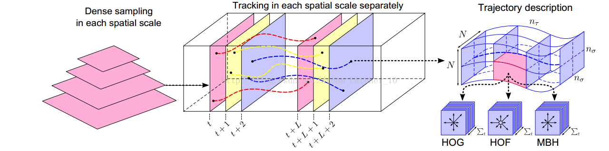

如图所示即为算法的基本框架，包括:

1. **密集采样特征点**，
2. **特征点轨迹跟踪**
3. **基于轨迹的特征提取**

## 密集采样

1. DT方法通过网格划分的方式在图片的**多个尺度上分别密集采样特征点**。

   在多个空间尺度上采样能保证采样的特征点覆盖了所有空间位置和尺度，通常8个空间尺度已经非常足够了，若图像很大，可以适当增加。后续的特征提取也是在各个尺度上分别进行的。

2. 特征点采样的间隔(即网格的大小)W通常取W=5。

> 多尺度的解释
>
> |                                                              |                                                              |                                                     |
> | ------------------------------------------------------------ | ------------------------------------------------------------ | --------------------------------------------------- |
> | 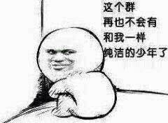 |  |  |

对图片进行缩放以便对各种尺度的对象都能进行识别。

## 特征点轨迹跟踪

在视频序列中对每一帧的兴趣点进行跟踪就形成trajectory，若是对每一帧密集采样兴趣点进行跟踪就形成dense trajectory；

1. 对采样点进行跟踪：由光流判断跟踪点在下一帧的位置；

   M为中值滤波器，w为光流场

2. 对每个点跟踪都会形成一条trajectory，**为了避免长时间跟踪而产生的跟踪点漂移现象**，可以对跟踪的长度L进行约束（L=15）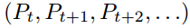

   > ==这里也就暴漏了该方法不能处理长视频的原因==

3. 现实视频中存在摄像头运动的缺陷，因此需要相应算法消除摄像头影响，得到最终的iDT；

## **基于iDT计算descriptor**

四种特征：

1. trajectory轨迹特征：

   每条trajectory都可以提取一个轨迹特征向量S'（当L=15，S’为30维），对局部动作模式进行编码

   

2. HOG特征：

   HOG特征计算的是**灰度图像梯度的直方图**。对视频块进行表面特征描述。直方图的bin数目为8。所以HOG特征的长度为2X2X3X8=96.

3. HOF特征：

   HOF计算的是**光流的直方图**。直方图的bin数目取为8+1，前8个bin与HOG都相同。额外的一个用于统计光流幅度小于某个阈值的像素。故HOF的特征长度为2*2*3*9=108.

4. MBH特征：

   MBH计算的是**光流图像梯度的直方图**，也可以理解为在光流图像上计算的HOG特征。由于光流图像包括X方向和Y方向，故分别计算MBHx和MBHy。MBH总的特征长度为2*96=192. 最后进行特征的归一化，DT算法中对HOG，HOF和MBH均使用L2范数进行归一化。

## 特征编码和分类过程

1. 特征编码—Bag of Features
2. 分类-SVM

# Two-Stream(NIPS2014)

> Two-stream convolutional networks for action recognition in videos[^4]

Two-Stream CNN网络顾名思义分为两个部分，

1. **空间流**处理**RGB图像**，得到形状信息;
2. **时间流/光流**处理**光流图像**，得到运动信息。

两个流最后经过softmax后，做分类分数的融合，可以采用平均法或者是SVM。不过这两个流都是二维卷积操作。最终联合训练，并分类。

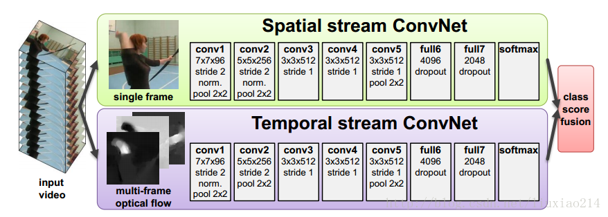

如图所示，其实做法非常的简单，相当于训练两个CNN的分类器。一个是专门对于 RGB 图的， 一个专门对于光流图的， 然后将两者的结果进行一个 fushion 的过程。

- RGB图的选择：

  是对于所给的一段视频随机挑选出视频中的**任意一帧**；

- 光流图的选择：

  视频中的任意一帧的时间然后及其后面的N帧叠合成一个光流栈进入训练。这种光流的训练方式是论文作者认为，这样子的光流叠加可以获得它的**运动信息流**，但是实际上光流图并不是以motion的信息来得到结果，有兴趣可以参看下面参考资料[^1]

  > 因为这个双流法是训练了两个网络，在最后 softmax 前进行了fushion，显示效果不错。这是一篇14年的开篇之作，在16年[^2]时候，有人对fushion的位置**==(可以类比通道混洗进行一番研究)==**进行了研究。

## 对于长范围时间结构的建模无能为力

主要因为它仅仅操作一帧（空间网络）或者操作短片段中的单堆帧（时间网络），因此**对时间上下文的访问是有限**的。视频级框架**TSN可以从整段视频中建模动作**。

# TSN(2016)

> Temporal Segment Networks Towards Good Practices for Deep Action Recognition

根据 two-stream 改进的网络框架。这一个框架的改进初衷是因为最原始版本的**two-stream对长视频的内容分类效果并不好**。

## 长视频处理的优点：

比如各个学校都是有运动会的，现在我们来到跳远场地拍了一段一位选手的**跳远过程视频**。然后我们将这段视频丢给原先的 Two-stream 框架进行测试，结果**得到了一个跑步的结果**。这是为什么呢？

就是因为我们**抽取机制的方式**，我们**随机抽取与训练的方式**，不能覆盖的这段视频的过程。因为跳远是一个助跑与跳的过程，他有比较强烈的时间序列性质。

## 与two-stream的对比：

1. 相同：

   TSN也是由空间流卷积网络和时间流卷积网络构成。

2. 不同：

   不同于two-stream采用**单帧或者单堆帧**。

   1. 采样：TSN使用从**整个视频中稀疏地采样一系列短片段**，
   2. 初步预测：**每个片段都将给出其本身对于行为类别的初步预测**，
   3. 提取共识：从这些片段的“共识”来得到视频级的预测结果。
   4. 在学习过程中，通过迭代更新模型参数来优化视频级预测的损失值（loss value）。

## TSN的改进

而TSN改进的方面非常的简单，它只是：

1. 先将视频**分成K个部分**，
2. 然后从每个部分中随机的**选出一个短的片段**，
3. 然后对这个片段应用上述的two-stream方法，
4. 最后**对于多个片段上提取到的特征做一个融合**。
   

## 细节：

由上图所示，一个输入视频被分为 K 段（segment），一个片段（snippet）从它对应的段中随机采样得到。不同片段的类别得分采用**段共识函数**（The segmental consensus function）进行**融合来产生段共识**（segmental consensus），这是一个视频级的预测。然后对所有模式的预测融合产生最终的预测结果。

具体来说，给定一段视频 *V*，把它按相等间隔分为 *K*K 段 ${S_1,S_2,⋯,S_K}$。接着，TSN按如下方式对一系列片段进行建模：

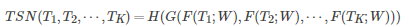

其中：

- (T1,T2,⋯,TK)代表片段序列，每个片段 Tk从它对应的段 Sk中随机采样得到。
- F(Tk;W)函数代表采用 W作为参数的卷积网络作用于短片段 Tk，函数返回 Tk 相对于所有类别的得分。
- 段共识函数 G（The segmental consensus function）结合多个短片段的类别得分输出以获得他们之间关于**类别假设的共识。**
- 基于这个共识，预测函数 H 预测整段视频属于每个行为类别的概率（本文 H  选择了Softmax函数）。
- 结合标准分类交叉熵损失（cross-entropy loss），关于部分共识的最终损失函数 G 的形式为：

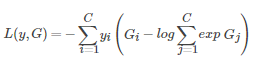

其中，C 是行为总类别数，yi 是类别 i 的groundtruth，实验中片段的数量 K 设置为3。本工作中共识函数 G 采用最简单的形式，即 Gi=g(Fi(T1),…,Fi(TK))，采用用聚合函数 g（aggregation function）从所有片段中相同类别的得分中推断出某个类别分数 Gi。聚合函数 g 采用均匀平均法来表示最终识别精度。

TSN是可微的，或者至少有次梯度，由 g 函数的选择决定。这使我们可以用标准反向传播算法，利用多个片段来联合优化模型参数 W。在反向传播过程中，模型参数 W 关于损失值 L 的梯度为：

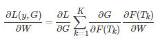

其中，K是TSN使用的段数。TSN从整个视频中学习模型参数而不是一个短的片段。与此同时，通过对所有视频固定 K，作者提出了一种稀疏时间采样策略，其中采样片段只包含一小部分帧。与先前使用密集采样帧的方法相比，这种方法大大降低计算开销.

# C3D(2015)

Learning spatiotemporal features with 3d convolutional networks[^3]

[github:Caffe](https://github.com/facebook/C3D)

> C3D是除了Two-Stream后的另外一大主流方法，但是目前来看C3D的方法得到的效果普遍比Two-Stream方法低好几个百分点。但是C3D仍然是目前研究的热点，主要原因是该方法比Two-Stream方法快很多，而且基本上都是端到端的训练，网络结构更加简洁。该方法思想非常简单，图像是二维，所以使用二维的卷积核。**视频是三维信息，那么可以使用三维的卷积核。**所以C3D的意思是：**用三维的卷积核处理视频。**

## **3D-CNN和2D-CNN的区别**

此部分采用C3D网络架构提取视频序列帧的特征，类似于2D卷积，3D卷积的形象描述如下图3(c)所示。3D卷积对H、W和L三个维度都进行卷积，而2D卷积（多通道(b)）只对H和W两个维度进行卷积，因此3D卷积得到的是三维输出，而2D卷积得到的是二维输出。

区别：

- a)和b)分别为2D卷积用于单通道图像和多通道图像的情况（此处多通道图像可以指同一张图片的3个颜色通道，也指多张堆叠在一起的图片，即一小段视频），对于一个滤波器，输出为一张二维的特征图，多通道的信息被完全压缩了。
- 而c)中的3D卷积的输出仍然为3D的特征图。

如果输入一段视频，其大小是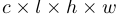,其中C是通道数(一般是3),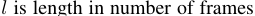，h和w分别是每帧的高和宽，3D卷积的卷积核和池化核也是3D的，很容易想象得到，就是比2D的往里扩展一个维度，所以核大小是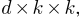d是核的时间深度，K*K是空间上的大小。

## 网络结构

网络结构也特别的简单：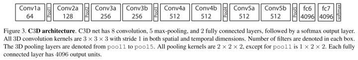

C3D共有8次卷积操作，5次池化操作。其中卷积核的大小均为3*3*3，步长为$1*1*1$。池化核为$2*2*2$，但是为了不过早的缩减在时序上的长度，第一层的池化大小和步长为1*2*2。

最后网络在经过两次全连接层和softmax层后得到的最终的输出结果。网络的输入为$3*16*112*112$，其中3为RGB三通道，16为输入图像的帧数，$112*112$是图像的输入尺寸。

# RPAN(ICCV2017)

> RPAN：An End-to-End Recurrent Pose-Attention Network for Action Recognition in Videos[^7]

参考[^5]

## 创新点：

- 不同于之前的pose-related action recognition，这篇文章是端到端的RNN，而且是spatial-temporal evolutionos of human pose
- 不同于独立的学习关节点特征(human-joint features)，这篇文章引入的pose-attention机制通过不同语义相关的关节点(semantically-related human joints)分享attention参数，然后将这些通过human-part pooling层联合起来
- 视频姿态估计，通过文章的方法可以给视频进行粗糙的姿态标记

## 网络结构

整个网络框架可以分成三个大的部分：

- 特征生成部分：Conv Feature cube from CNN
- 姿态注意机制：Pose-Attention Mechanism
- LSTM：RNN网

下面是整体网络结构图：

1. 特征生成部分Convolution Feature Cube from CNN

   作者采用了 two-stream CNN[^4]的网络框架，生成了convolution cubes。包含空间和时间上的。

2. Pose Attention Mechanism(姿态注意机制)

   1. Step1： 

      经过上述two-stream cnn后生成了 K1 x K2 x dc的特征图，文章中叫convolutional cube。然后作者定义了一个Ct，表示第t个视频帧在不同空间位置上的特征向量。空间图是K1xK2的大小，共dc个通道。所以Ct是K1xk2个dc维的向量。Ct的定义如下: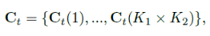

   2. Step2：

      作者定义了一些关节点，总共有13个。然后由这13个关节点，作者定义了5个身体的part。定义如下图所示。

      

   3. Step3：

      经过pooling层，将所有part特征整合到一起。使用的方法就是简单的Max,Mean or Concat。

      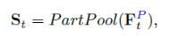

   

3. LSTM

   最后将St输入到LSTM网络中：

   

# CDC(CVPR2017)

> Convolutional-De-Convolutional Networks for Precise Temporal Action Localization in Untrimmed Videos[^9]

在C3D网络的后面增加了时间维度的上采样操作，做到了帧预测(frame level labeling)。以下是文章主要贡献点。

- 第一次将卷积、反卷积操作应用到行为检测领域，CDC同时在**空间域上下采样**，在**时间域上上采样**。
- 利用CDC网络结构可以做到**端到端的学习**[^8]。
- 通过反卷积操作可以做到**帧预测**(Per-frame action labeling)。

## 网络结构

CDC网络在C3D的基础上用反卷积，将时序升维。做到了帧预测。以下是CDC网络的结构图。

网络步骤如下所示。

- 输入的视频段是112x112xL，连续L帧112x112的图像
- 经过C3D网络后，时间域上L下采样到 L/8, 空间上图像的大小由 112x112下采样到了4x4
- CDC6: 时间域上上采样到 L/4, 空间上继续下采样到 1x1
- CDC7: 时间域上上采样到 L/2
- CDC8：时间域上上采样到 L，而且全连接层用的是 4096xK+1, K是类别数
- softmax层

CDC网络的最终输出形状是(K+1，L，1，1)，其中K+1表示K个动作类别加上背景类。

## CDC FILTER

文章的还有一大贡献点是反卷积的设计，因为经过C3D网络输出后，存在时间和空间两个维度，文章中的CDC6完成了时序上采样，空间下采样的同时操作。

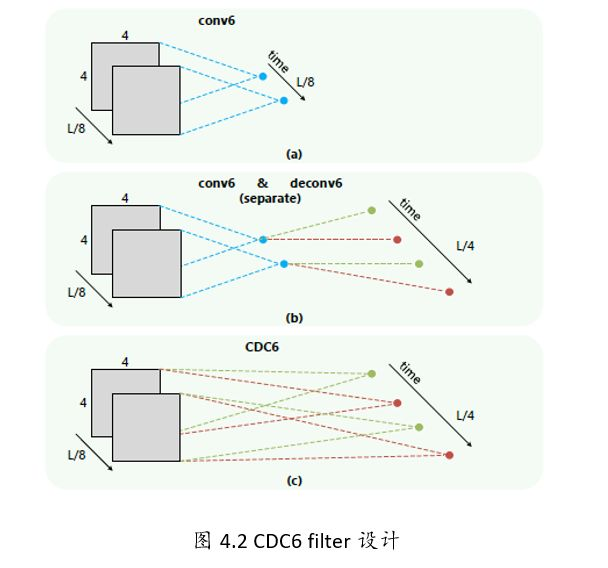

如上图所示，（a）(b)一般的都是先进行空间的下采样，然后进行时序上采样。

(c)但是CDC中设计了两个独立的卷积核(下图中的红色和绿色)。同时作用于112x112xL/8的特征图上。每个卷积核作用都会生成2个1x1的点，如上conv6，那么两个卷积核就生成了4个。相当于在时间域上进行了上采样过程。

# R-C3D(ICCV2017)

> R-c3d: Region convolutional 3d network for temporal activity detection[^10]

## 网络结构

输入是整个视频（或者任意长度视频段），C3D特征的输出被第2步和第3步共享。

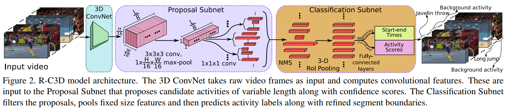

网络的总体结构:

1. 特征提取网络:

   C3D网络构成的特征提取网络提取特征，等效于Faster-RCNN中的ImageNet预训练的特征网络。骨干网络作者选择了C3D网络，经过C3D网络的5层卷积后，可以得到512 x L/8 x H/16 x W/16大小的特征图。这里不同于C3D网络的是，R-C3D**允许任意长度的视频L作为输入**。

2. **Temporal Proposal Subnet**给出建议区域:
  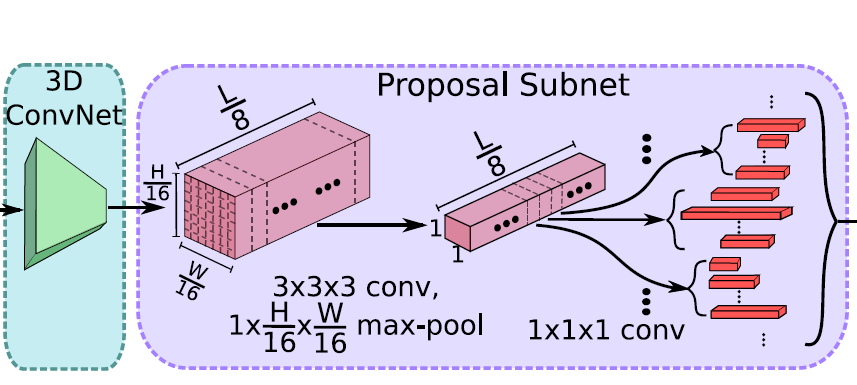

   根据C3D特征，给可能包含活动（activities）的时间区域（propose temporal regions）。等效于Faster-RCNN中的RPN,这里被称为Proposal Subnet

   1. 候选时序生成

      输入视频经过上述C3D网络后得到了512 x L/8 x H/16 x W/16大小的特征图。然后作者假设anchor均匀分布在L/8的时间域上，也就是有L/8个anchors，每个anchors生成K个不同scale的候选时序。

   2. 3D Pooling

      得到的 512xL/8xH/16xW/16的特征图后，为了获得每个时序点（anchor）上每段候选时序的中心位置偏移和时序的长度，作者将空间上H/16 x W/16的特征图经过一个3x3x3的卷积核和一个3D pooling层下采样到 1x1。最后输出 512xL/8x1x1.

   3. Training

      类似于Faster R-CNN，这里也需要判定得到的候选时序是正样本还是负样本。文章中的判定如下。

      - 正样本：IoU > 0.7，候选时序帧和ground truth的重叠数
      - 负样本： IOU < 0.3
   为了平衡正负样本，正/负样本比例为1:1.
  
3. Activity Classification Subnet行为分类子网络:

   根据C3D特征和建议区域，得到区域内的实际活动（activities）类型，比如图中的跑步。等效于Faster-RCNN中的ROI POOLING+网络后半段的分类网络，这里被称为Classification Subnet。

   

   1. NMS

      针对上述Temporal Proposal Subnet提取出的segment，采用NMS(Non-maximum Suppression)非极大值抑制生成优质的proposal。NMS 阈值为0.7.

   2. 3D RoI

      RoI (Region of interest,兴趣区域).这里，个人感觉作者的图有点问题，提取兴趣区域的特征图的输入应该是C3D的输出，也就是512xL/8xH/16xW/16，可能作者遗忘了一个输入的箭头。 假设C3D输出的是 512xL/8x7x7大小的特征图，假设其中有一个proposal的长度（时序长度）为lp，那么这个proposal的大小为512xlpx7x7，这里借鉴SPPnet中的池化层，利用一个动态大小的池化核，ls x hs x ws。最终得到 512x1x4x4大小的特征图

   3. 全连接层

      经过池化后，再输出到全连接层。最后接一个边框回归(start-end time )和类别分类(Activity Scores)。

   4. Traning

      在训练的时候同样需要定义行为的类别，如何给一个proposal定label？同样采用IoU。

      - IoU > 0.5，那么定义这个proposal与ground truth相同
      - IoU 与所有的ground truth都小于0.5，那么定义为background

      这里，训练的时候正/负样本比例为1:3。

[^1]:https://blog.csdn.net/elaine_bao/article/details/80891173【光流在视频识别中的作用】
[^2]:https://arxiv.org/abs/1604.06573
[^3]:Tran D, Bourdev L, Fergus R, et al. Learning spatiotemporal features with 3d convolutional networks[C]//Computer Vision (ICCV), 2015 IEEE International Conference on. IEEE, 2015: 4489-4497.http://vlg.cs.dartmouth.edu/c3d/c3d_video.pdf
[^4]:Simonyan K, Zisserman A. Two-stream convolutional networks for action recognition in videos[C]//Advances in neural information processing systems. 2014: 568-576.
[^5]:https://blog.csdn.net/neu_chenguangq/article/details/79164830?utm_source=blogxgwz7
[^6]:https://zhuanlan.zhihu.com/p/34439558

[^7]: Du W, Wang Y, Qiao Y. Rpan: An end-to-end recurrent pose-attention network for action recognition in videos[C]//Proceedings of the IEEE Conference on Computer Vision and Pattern Recognition. 2017: 3725-3734.
[^8]: https://blog.csdn.net/weixin_38145317/article/details/90902425【什么是端到端的训练或学习】
[^9]: Shou Z, Chan J, Zareian A, et al. CDC: convolutional-de-convolutional networks for precise temporal action localization in untrimmed videos[C]//2017 IEEE Conference on Computer Vision and Pattern Recognition (CVPR). IEEE, 2017: 1417-1426.
[^10]:Xu H, Das A, Saenko K. R-c3d: Region convolutional 3d network for temporal activity detection[C]//The IEEE International Conference on Computer Vision (ICCV). 2017, 6: 8.https://arxiv.org/pdf/1703.07814.pdf